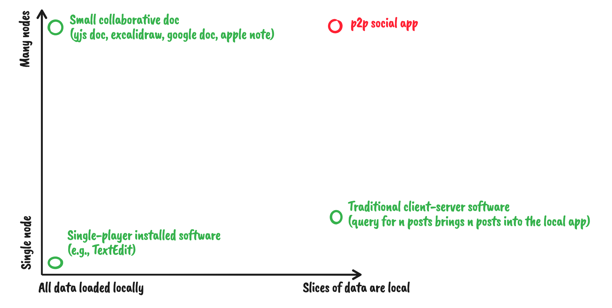

In a local/offline-first world, how do we query for (and keep up to date) the data needed by our app? The answers differ based on where on the spectrum your state needs sit.

**Bottom left** - All of the data is local and the are no peers to collaborate with. Here we can use traditional methods such as saving data in a db or in the filesystem & querying it with SQL or filesystem operations. Data is always up to date given there are no changes to bring in from peers. Example here being the `TextEdit` app on MacOS or `Notepad` on Windows.

**Top left** - the entire dataset fits on each peer but there are many peers to collaborate with. Queries can still be fully resolved against the local dataset. The local dataset is subscribed to all changes from all peers so it stays up to date. Examples here being a yjs doc, google doc, excalidraw drawing.

**Bottom right** -
Traditional client-server apps fit here. In this case there are two "peers": the service provider and the client. Clients don't interact directly -- instead are abstracted away by the service provider. Slices of data are loaded from the service provider into the client app & updates are received via subscriptions. The "local" data is also only a cache and can be blown away at any point by an update from the service which is the authoritative source.

Very similar to traditional client-server apps, we have offline-first client-server apps. This is the same as the client-server case but the big difference is that the local data is no longer seen as simply a cache but as an authoritative source of information. The client can function and modify data while offline. This "functioning offline" means that queries are considered fulfilled even if they're only fulfilled from local data and do not include server sent data. There are two sides to this: all state can be sent to the client or only slices of state can be sent to the client.

**Top right** - in the most difficult quadrant, we have the case where
- Many peers exists and collaborate directly with one another
- The total dataset is too large to fit on one peer or too write heavy for a peer to subscribe to all changes

An example here being a p2p social app. Smaller scale examples would be perf optimizations where you shouldn't receive updates to things you're not interacting with.

> Note: traditional client-server software is only included for illustrative purposes. It doesn't belong in the chart given its sychronization protocol is that of a single master (the service provider) arbitrating changes.

- Claim 1: the green cases are all already solved or easily solved. 
- Assumption 1: the top right corner is the most generic case and solutions for that can support all other cases.
- Assumption 2: using solutions for the top right to solve for all areas is no more complex than using solutions dedicated to those areas

Given claim 1, we'll focus only on the orange and red cases.

What both cases have in common are that the clients can only keep local slices of data.

# Local Slices

There's two factors to consider when thinking over local slices.
1. Is the data model hierarchichal and data access always done in a hierarchichal way?
2. Is data non hierarchichal or accessed in non-hierarchical ways?

Case (1) is pretty straightforward to solve
1. Slice the data model up into manageable docs
2. The application only subscribes to the subset of docs it currently cares about

Examples being --

- Filesystem / DropBox like apps. Each folder can be a doc the contents of which is an index (the file names) of what is in the folder. The client only fetches and subscribes to the folders and documents they have open. For folders with thousands of items will only be tens of KBs. Updates to those docs will be small deltas.
- Wikis and Blogs. For the blog case -- open a post you're interested in, download it, model comments as a field nested on the post, subscribe to the post to receive new comments and post edits.

Thesis 1: local slices of state is a trivial problem when the data is hierarchichal and accessed in a hierarchichal way.

You start to run into problems as soon as you want to access the data in a non-hierarchichal way. If you want to implement a feed of comments or search and interact with all blocks (like tables) in something like a notion doc that match a given criteria.

If there are unbounded connections or we try to start to normalize our data to build more complex features we run into issues.

## Unbounded Connections

## Normalizing

For reference, we'll imagine a distributed social app used by an organization of ~1k users.

The model above can get us pretty far (how far?) but we run into problems if we want to do things like
- fetch the latest 20 comments
- search across all wiki pages

E.g., a group has thousands of posts and we only want to load the first 10 on the client or only posts with a given tag.

# Client-Server, Offline-First, Local Slices

# Many Peers, Local Slices

For reference, we'll imagine a distributed social app used by an organization of ~1k users.

Slide authoring software? Inventory management? Social app?

There's two factors to consider in this quadrant:
1. Is the set of documents known such that we can simply subscribe to documents directly?
2. Are the "unbounded" connections?

Case (1) is pretty straightforward
1. The data model is sliced up into manageable docs
2. The application only subscribes to docs it currently cares about

If any doc has an unbounded connection to some other set of docs, however, we start to run into issues. E.g., a group has thousands of posts and we only want to load the first 10 on the client or only posts with a given tag.

# Transparency & Layering

# Polyglot

## DB support?

reMarkable-2.12.2.251