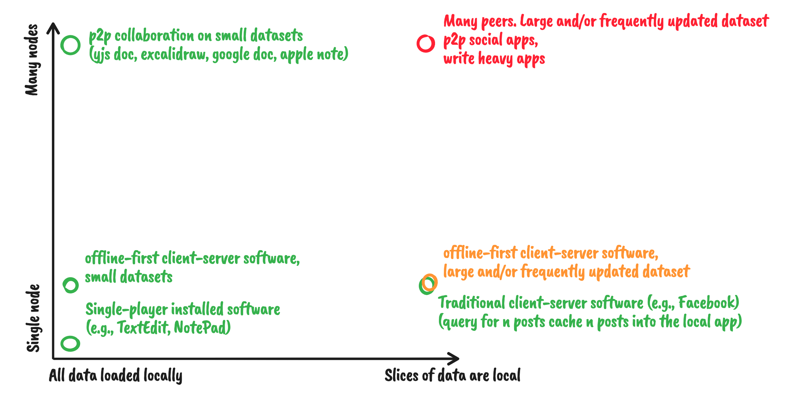

In a local/offline-first world, how do we query for (and keep up to date) the data needed by our app? The answers differ based on where on the spectrum your state needs sit.

On one side, all of the data is local and the are no peers to collaborate with. Here we can use traditional methods such as saving data in a db & querying it with SQL. Data is always up to date given there are no changes to bring in from peers.

On another side, the entire dataset fits on each peer but there are many peers to collaborate with. Queries can still be fully resolved against the local dataset. The local dataset is subscribed to any and all changes from all peers so it stays up to date.

Briefly -- traditional client-server apps fit in this spectrum. In this case there are two "peers": the service provider and the client. Clients don't interact directly -- instead are abstracted away by the service provider. Slices of data are loaded from the service provider into the client app & updates are received via subscriptions. GraphQL, Apollo, Rest, long polling, websockets, etc. all exist as solutions here.

On the most difficult end
- Many peers exists and collaborate with one another
- The total dataset is too large to fit locally or too write heavy to subscribe to all changes

An example here being a p2p social app. Smaller scale examples would be perf optimizations where you shouldn't receive updates to things you're not interacting with.

- Claim 1: the first 3 cases are all already solved or easily solved.
- Assumption 1: the top right corner is the most generic case and solutions for that can support all other cases.
- Assumption 2: using solutions for the top right to solve for all areas is no more complex than using solutions dedicated to those areas

Given claim 1, we'll focus only on the top right corner: only slices of data are local & many peers.

# Many Peers, Local Slices

# Layering

There's two factors to consider on this side:
1. Is the set of documents known such that we can simply subscribe to documents directly?
2. Are the "unbounded" connections?

