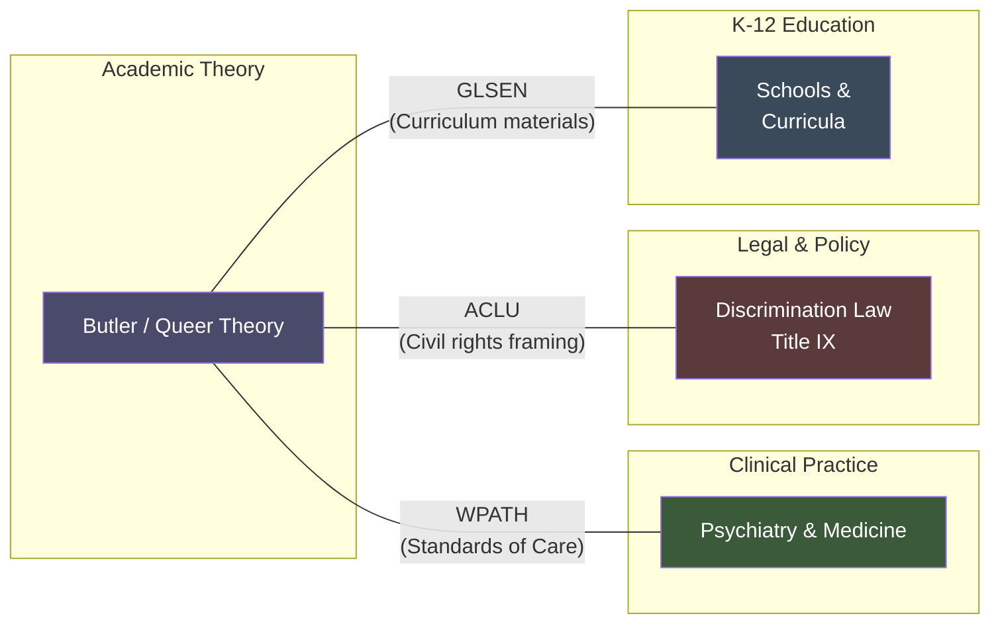
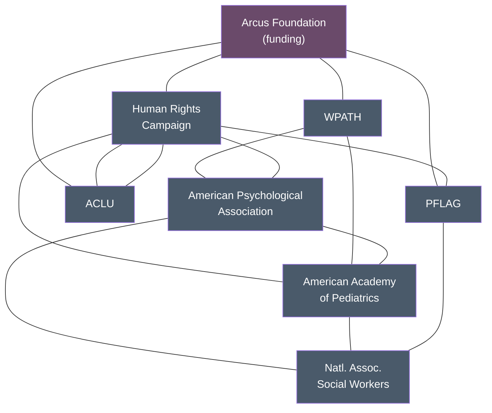
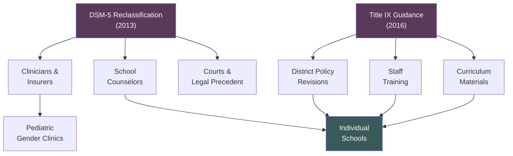
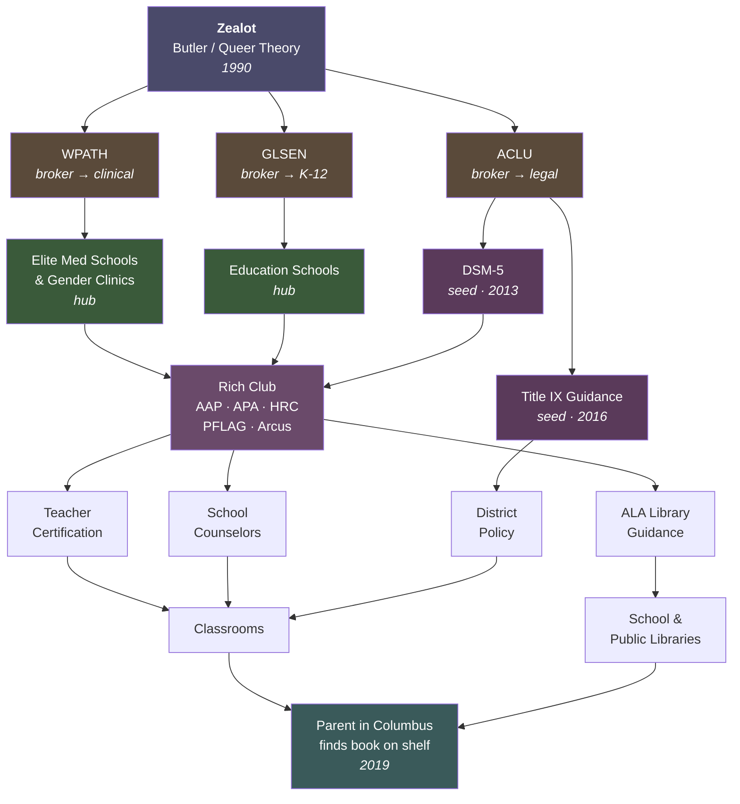

The following applies the [[2026-03-28-network-conspiracy:five-mechanism network framework]] — zealot persistence, structural holes, preferential attachment, rich-club propagation, and influence maximization — to the spread of gender identity ideology from academic theory into elementary school curricula and public library programming. The goal is not polemic in either direction. It is to show that the same structural logic that produced [[2026-03-28-network-conspiracy:shareholder primacy in corporate governance]] produced this outcome, and that both are better explained by network dynamics than by either conspiracy or accident.

---

## The Zealot Node

Every cascade requires a node that holds fixed while everything around it shifts. In this case the origin is not a single document but a cluster: academic queer theory as it crystallized in the late 1980s and early 1990s, with Judith Butler's *Gender Trouble* (1990) as its most legible expression.

Butler's core claim — that gender is not a biological given but a social performance, iteratively constructed through repeated acts — was not new in substance. John Money had argued at Johns Hopkins from the 1950s onward that gender identity was socially malleable and largely independent of biological sex. What Butler added was a theoretical architecture rooted in poststructuralism that made the claim feel philosophically rigorous and academically defensible.

The position was zealot in the technical sense: held with conviction, resistant to updating from biological or psychological countervailing evidence, and embedded in institutions — humanities departments, women's and gender studies programs — where the social incentives strongly rewarded holding rather than revising. Through the 1990s and into the 2000s, the mainstream medical, psychiatric, and legal consensus did not share this view. Gender identity disorder remained a diagnosis. The zealot cluster held its position at the academic periphery while the broader network remained elsewhere.

This is precisely the condition that [[2026-03-28-network-conspiracy:zealot dynamics]] predict as maximally influential: a committed minority holding a fixed position while the surrounding consensus is unstable. The consensus began destabilizing in the 2000s, and the held position became the available answer.

---

## The Structural Hole Brokers

Academic gender theory and clinical psychiatric practice were, through the 1990s, largely disconnected clusters. Humanities departments and medical schools did not speak the same language, attend the same conferences, or share the same professional incentives. The gap between them was a [[2026-03-28-network-conspiracy:structural hole]].

Several organizations moved into that hole and became brokers.

The World Professional Association for Transgender Health (WPATH), formerly the Harry Benjamin International Gender Dysphoria Association, sat at the junction between clinical practice and transgender advocacy. It issued the *Standards of Care* — a clinical document that carried the formatting and authority of medical consensus while being produced by a membership organization whose composition weighted heavily toward advocates and practitioners already committed to affirmative approaches. WPATH translated the academic position into clinical language and made it legible to medical institutions that would not have imported it directly from gender studies departments.

On the legal and policy side, the ACLU and a network of civil rights law firms occupied the structural hole between activist theory and enforceable policy. They translated the academic claim — gender is self-defined, socially constructed, and distinct from biological sex — into legal frameworks: discrimination law, Title IX interpretation, employment protections. This translation was essential. It converted a philosophical claim into an institutional mandate, with legal liability attached to non-compliance.

GLSEN (Gay, Lesbian and Straight Education Network) occupied the structural hole between LGBT advocacy and K-12 education. It produced curriculum materials, teacher training resources, and model policies that made the academic framework legible to school administrators who would not have read Butler and would not have known how to implement a philosophically derived framework without translation.

In each case, the broker did not invent the ideas. It arbitraged them across a gap that would have slowed their propagation enormously without the bridging node.

---

## The Preferential Attachment Hubs

Once the framework was translated into clinical, legal, and educational language, it needed hubs to amplify it.

Elite universities were the first-order hubs. Schools of education, schools of social work, and clinical psychology programs at high-prestige institutions were the most connected nodes in their respective fields — the places that trained the most practitioners, produced the most research, placed graduates in the most influential positions. When affirmative gender identity frameworks entered these programs as the academically sanctioned approach, they propagated not as ideology but as professional training. A social worker graduating from a top-ten program in 2010 carried the framework as clinical default. The more graduates used it, the more legible it became to the institutions they entered, which raised the status of programs that trained for it, which attracted more students, which produced more graduates carrying the same default.

Major pediatric hospital gender clinics became the second-order hubs. Boston Children's, CHOP, Seattle Children's — institutions that already concentrated the most referrals, the most research funding, and the most influential clinicians in pediatric medicine. As these hubs adopted affirmative care protocols and published accordingly, they set the standard for the field. Smaller hospitals and community clinics, seeking to be legible and avoid liability, followed hub practice. This is preferential attachment operating in reverse: the periphery connects to the hub's protocol rather than developing its own.

School library associations — particularly the American Library Association — functioned as acquisition hubs. Publishers developing gender identity titles for children sought ALA recognition. ALA recognition drove library acquisitions. Library acquisitions drove classroom availability. The hub's curatorial choices cascaded into hundreds of thousands of school libraries without any individual school making an ideological decision. They were following the hub.

---

## The Rich Club

By the 2010s, a dense cluster of highly connected organizations had formed a [[2026-03-28-network-conspiracy:rich club]] around gender identity advocacy: the Human Rights Campaign, PFLAG, the ACLU, WPATH, the American Psychological Association, the National Association of Social Workers, the American Academy of Pediatrics, and a set of major philanthropic foundations — most consequentially the Arcus Foundation, which by the early 2010s was the largest single funder of LGBT advocacy globally, and which connected many of the other club members through shared grant relationships.

The rich-club characteristics are visible. Internal communication was fast and dense: the same individuals sat on advisory boards across multiple organizations, attended the same conferences, co-authored the same policy documents. Position changes propagated through the club rapidly and with low noise. When the AAP updated its guidance on gender-affirming care, the HRC, PFLAG, and NASW amplified it immediately. When the APA published updated standards, WPATH and AAP cited them within months. The club's outputs became mutually reinforcing citations in a closed loop that, from outside, had the appearance of independent institutional consensus.

The Arcus Foundation's role deserves emphasis because it illustrates the rich-club mechanism precisely. Arcus did not instruct its grantees on position. It funded organizations that already held aligned positions, which concentrated resources among the most committed nodes, which made those nodes more connected and more influential, which reinforced the cluster. No coordination was required. Funding preferentially attached to aligned nodes, and those nodes preferentially connected to each other.

---

## The Influence Maximization Seeds

Two events in rapid succession functioned as [[2026-03-28-network-conspiracy:influence maximization]] seeds: they were placed in the highest-leverage nodes in the network and initiated cascades that the network's structure then propagated far beyond what the seeds themselves could have achieved directly.

The first was the DSM-5 reclassification in 2013. The American Psychiatric Association replaced "gender identity disorder" — a diagnostic category that framed distress as the condition requiring treatment — with "gender dysphoria," a category that located the distress in the social non-affirmation of an authentic gender identity. The philosophical shift was enormous. The practical effect was to make the affirmative framework the default clinical posture of American psychiatry, with the world's most authoritative diagnostic manual as the citation. Clinicians, insurers, school counselors, and courts could now cite the DSM. The seed entered the most connected node in mental health practice and cascaded from there.

The second was the Obama administration's 2016 guidance letter to schools on Title IX, which instructed that federal sex discrimination law applied to gender identity and that schools receiving federal funding should treat students according to their stated gender identity in matters including bathrooms, sports, and records. This was guidance, not law — it had no formal legal force. But it entered the most connected node in K-12 education: federal funding dependency. Schools that wanted to avoid perceived legal exposure began revising policies, training staff, and updating materials without waiting for any legislative mandate. The seed had been placed in a hub whose connections reached every public school in the country.

---

## The Cascade

From these five mechanisms, the propagation to drag story time and *Bobby Is a Girl* in elementary school libraries is not a straight line. It is a network cascade, and it looks like one: non-linear, faster than anyone predicted, seemingly decentralized, and very difficult to stop once the hub nodes had adopted the framework.

Teacher certification programs — themselves connected to the education school hubs — updated curricula to include gender identity as a diversity and inclusion competency. Teachers completing certification carried the framework into classrooms as professional training, not ideological choice. School librarians, following ALA acquisition guidance and responding to publisher marketing that increasingly foregrounded gender identity titles with professional recognition, stocked the books. School counselors, trained in programs that had adopted affirmative protocols and citing the DSM-5, implemented social transition support without parental notification in districts that had adopted policies following the 2016 guidance. Public libraries, connected to the same ALA hub and responsive to the same programming trends, began hosting drag story time events that originated in San Francisco in 2015 and propagated through the library network as a model program.

At no point in this cascade did anyone issue a central directive. A parent in a suburb of Columbus, Ohio, encountering *George* (later retitled *Melissa*) on their third-grader's classroom bookshelf in 2019, was downstream of a network that included a philosopher in Berkeley, a clinical standards document from an international medical association, a philanthropic foundation's grant portfolio, a federal guidance letter, and a library association's recommended reading list. None of those nodes knew about the Columbus parent. None of them were in control. All of them were predictive.

---

## Why This Cascade Was Fast

The [[2026-03-28-network-conspiracy:shareholder primacy cascade]] took roughly thirty years to move from Friedman's 1970 essay to functional hegemony in the late 1990s. The gender identity cascade moved from academic periphery to elementary school curricula in roughly ten. The five mechanisms are the same. The speed difference requires explanation, and the explanation is structural.

**The network was pre-built.** The gay rights movement had already wired the organizational infrastructure that gender identity advocacy inherited. HRC, the ACLU, PFLAG, and the major philanthropic foundations were not new nodes that had to be created and connected. They were already densely linked, already funded, already experienced at translating academic claims into legal and institutional language. The shareholder primacy cascade had to construct its network — think tanks, law and economics programs, business school curricula — from near-zero. The gender identity cascade plugged into a network that had just won its previous fight. The wiring was hot.

**Social media created a parallel cascade.** The institutional top-down cascade described above was happening simultaneously with a grassroots bottom-up cascade through Tumblr, Twitter, and later TikTok that had no equivalent in the shareholder primacy story. These two cascades reinforced each other. Activist framing circulated on social media. Journalists on Twitter amplified it. Institutional actors, monitoring the same platforms, experienced the framing as emergent public consensus rather than activist pressure. Institutions responded, which validated the framing, which circulated back through social media as proof of mainstream acceptance. The shareholder primacy cascade propagated through a single institutional channel. This one propagated through two channels simultaneously, each accelerating the other.

**The civil rights framing removed friction in one direction.** The ACLU's brokering did something beyond translation. By mapping gender identity onto the existing civil rights framework, it created an asymmetric cost structure. Adopting the new framework carried no professional risk for a teacher, school administrator, pediatrician, or corporate HR department. Questioning it carried potentially career-ending risk — not from any central enforcer, but from the legal and reputational exposure that the civil rights framing made automatic. This is not just a cascade. It is a cascade with friction removed in the direction of adoption and added in the direction of resistance. The result is speed that looks like consensus but is partly compliance.

**The opposition was elsewhere during the critical window.** Religious and social conservatives — the nodes most likely to generate counter-signals — were focused on opposing same-sex marriage through 2015. The *Obergefell* decision in June of that year absorbed the organizational energy, funding, and public attention of the counter-network at precisely the moment when the DSM-5 reclassification (2013) and the Title IX guidance (2016) were seeding the cascade. By the time conservative organizations pivoted to gender identity as a primary concern, the institutional cascade was already downstream of the hubs. The window between 2013 and 2017 was largely uncontested in institutional space. In network terms, the counter-signal arrived after the cascade had already passed the critical threshold.

These four factors are not separate from the five-mechanism framework. They are network-level accelerants: a pre-wired topology, a parallel propagation channel, asymmetric friction, and a temporarily absent counter-network. Together they explain why the same structural logic that took three decades in one case took one decade in another.

---

## What the Map Shows

The parallel to shareholder primacy is close enough to be instructive.

Both cascades began with a zealot cluster holding a position at the intellectual periphery during a period of mainstream consensus stability. Both found structural hole brokers who translated academic claims into clinical, legal, or professional language. Both propagated through preferential attachment hubs — elite universities, professional associations, curriculum developers — that amplified without conspiring. Both developed rich clubs of interconnected organizations whose internal communication speed made their outputs look like independent consensus. Both were seeded into maximum-leverage nodes at a critical moment, producing cascades the network's existing structure then carried.

The political valences are opposite. The structural logic is identical.

This is precisely what the network account predicts: the mechanisms don't care about the content. Preferential attachment amplifies whatever enters the hubs. The rich club propagates whatever achieves internal consensus. Zealots who hold long enough, in a network whose surrounding consensus becomes unstable, will find their moment regardless of what they are zealous about.

The conspiracy theorist watching drag story time arrive at a public library sees a coordinated agenda and names the organizations behind it. They are not wrong that the organizations are real, that their outputs are coordrelated, that the outcomes were predictable from watching those nodes. They are wrong about the mechanism. The coordination is structural, not intentional. The agenda is an emergent property of network dynamics, not a plan.

The naive liberal response — *it's just inclusion, it's just books, no one is imposing anything* — is also wrong, in the opposite direction. The cascade did impose. It restructured the available choices in a child's school environment without the parents who would have objected being consulted or even aware of the mechanism that produced the change. The [[2026-03-28-network-conspiracy:kosher certification dynamic]] operates here too: a committed minority's non-negotiable commitments, carried through institutional nodes, reshaped the default environment for everyone else.

The network account holds both. The nodes were real and predictive. No one was driving. And the outcome, including its reach into institutions that had no intention of becoming sites of ideological contestation, followed as structurally as a flood follows a watershed.