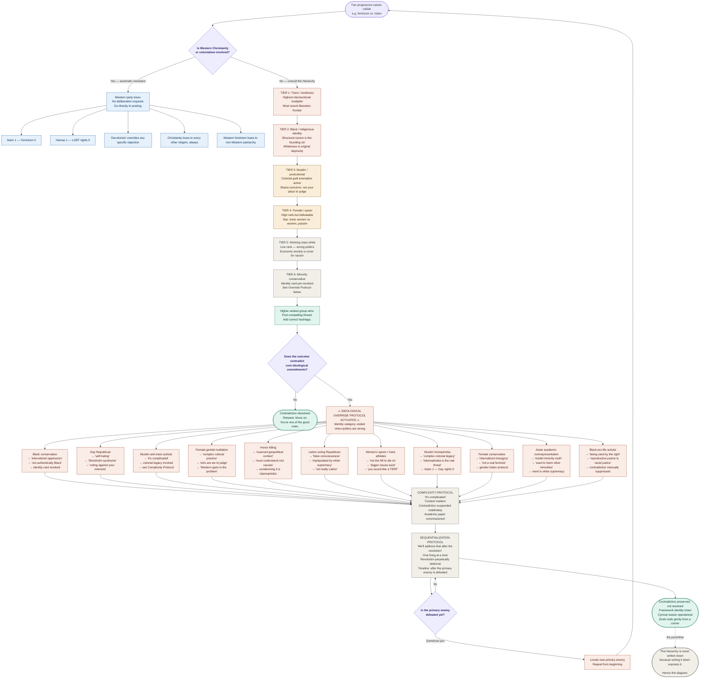

### A Field Guide to Never Being Wrong

> *The following hierarchy does not exist. It has never been written down. This is the first time it has been written down. Please do not share.*

---

---

## Diagnostic Key

| Node color | Meaning |
|---|---|
| Purple | Decision point (apply logic here) |
| Blue | Western-association auto-resolve |
| Red/coral | High victim-hierarchy rank or override activated |
| Amber | Mid-tier hierarchy |
| Gray | Escape hatch protocols |
| Green | Terminal resolution (rare) |

---

## Footnotes

**On the Override Protocol:** Note that the Override Protocol does not mean identity categories are worthless. It means they are *instrumentally* valuable — useful when they produce the correct political conclusion, void when they do not. The identity is the ticket; the ideology is the destination. If you use the ticket to go the wrong way, the ticket is cancelled.

**On Complexity:** "It's complicated" is not an admission of uncertainty. It is a load-bearing rhetorical structure. It acknowledges that a contradiction exists while simultaneously foreclosing the obligation to resolve it. Complexity is the system's immune response to honest analysis.

**On Sequentialization:** The revolution has been approximately eighteen months away since 1917. Contradictions deferred until after it are therefore deferred permanently. This is a feature, not a bug.

**On the circular node:** The discovery that the primary enemy has been defeated triggers an automatic search for a new primary enemy. This is not cynicism. This is structural necessity. A movement organized around opposition requires an opponent. When the opponent falls, the movement does not dissolve — it finds a new opponent. This process has no known termination condition.

**On Zizek:** He has been in that corner for thirty years. Nobody has asked him to leave. Nobody has asked him to move closer either.

---

*This diagram was produced by applying the progressive framework to itself. The results are, in the framework's own terminology, complicated.*